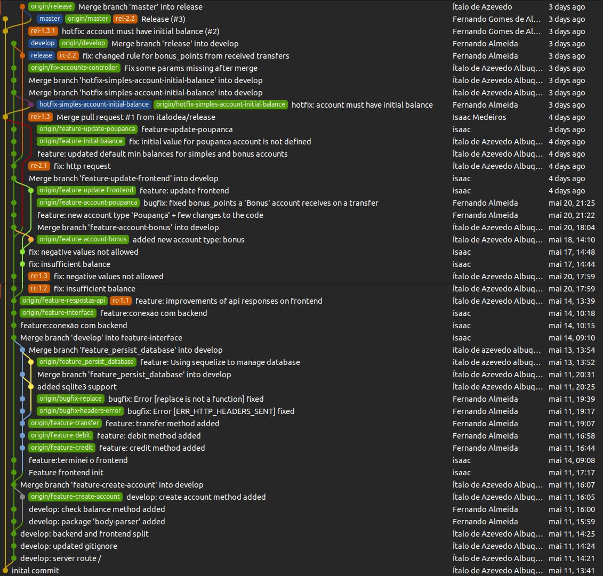

# Sistema Bancário

## Sobre
Repositório destinado para o desenvolvimento de Sistema Bancário para a disciplina de Gerência de Configurações e Mudanças. O projeto segue o padrão GitFlow para a organização das branches e fluxo de desenvolvimento.

## O GitFlow
O GitFlow é um modelo de branching que visa facilitar o gerenciamento de versões e o fluxo de trabalho em projetos de desenvolvimento de software. Seguimos as seguintes diretrizes:
- Branches Principais:
  - **master**: destinada às versões liberadas para produção.
  - **develop**: destinada ao desenvolvimento contínuo do projeto.

- Branches de Funcionalidades:
  - **feature**: cada nova funcionalidade é desenvolvida em sua própria branch de feature. Após a conclusão, a branch é mesclada na branch develop.

- Branches de Release:
  - release: destinada à estabilização da versão antes de ser liberada para produção.

- Branches de Correção de Erros:
  - bugfix: Para erros encontrados na versão de desenvolvimento, são criadas branches de feature específicas para resolver esses problemas. Após a finalização, a branch é mesclada na branch develop.

- Branches de Correção Emergencial:
  - hotfix: Para erros encontrados na versão em produção, são criadas branches de hotfix para resolver esses problemas. Após a finalização, a branch é mesclada na master e na develop.

- Tags: são criadas tags para marcar versões de interesse, como Baselines e Releases.

## Visão Geral do Projeto

<!-- ## Ferramentas Utilizadas
As ferramentas utilizadas foram: 

- HTML, css e JavaScript
- SQLite -->

## Autores
- [Fernando Almeida](https://github.com/feronando) 
- [Isaac Medeiros](https://github.com/zacmeedeiros)
- [Ítalo de Azevedo](https://github.com/italodea)
